# 10 Seismic Equations

This notebook has origin from article named "TEN TRAVELTIME EQUATIONS IN SEISMICS:
COMPLETE DERIVATIONS AND APPLICATIONS", where 10 equations of seismic time travel where developed. The calculation of transit time is of great importance
for seismic processing and imaging. In thiswork, we gathered and reviewed the derivations of ten transit time equations which contains the calculations of transit times for: direct waves, waves reflected in a parallel and inclined plane medium, first-order multiples in a parallel and inclined plane medium, P-SV and SV-P converted waves, refracted waves in a parallel and inclined plane medium, diffracted waves in two cases, and for a 1D heterogeneous medium.

## Methodology

For the calculation of transit time, the following methodology was mainly used:

1) Define a model of two homogeneous and isotropic layers with velocities $v_1$ and $v_2$. The depth of the reflector is given by $z$.

2) Define $x$ as the distance between the source and receiver. The source is represented by a red star and the receiver is represented by a blue triangle.

3) Apply the idea of ​​an image point where the reflector is interpreted as a mirror and the source can then be projected to an equidistant location, facilitating the calculation of the ray's path in the case of multiple reflections.

4) Calculate the total path of the ray using trigonometry. The transit time can be found using the general equation:

$$ \text{travel time}=\dfrac{\text{total trajectory of the ray}}{\text{medium velocity}}$$

The main objective of this notebook is to present the modeling codes from equations described in the aforementioned article. For more detailed information we recomend it's reading.

For exemplification and visualization of code results, we defined:
 - x = 2500 meters and it's a set of 50 equidistant points.
 - z = 200 meters
 - v1 = 2100 meters per seconds (m/s)
 - v2 = 2900 meters per seconds (m/s)
 - $\theta$ = 30 degrees
 - $\alpha$ = 60 degrees
 - $\phi$ = 45 degrees

Importing libraries and variables


```python
import math
import numpy as np
import matplotlib.pyplot as plt
import matplotlib.image as mpimg
```


```python
x=np.linspace(0, 2500, 50)
z=200
v1=vs1=2100
v2=vp1=2900
theta = np.deg2rad(30)
zu=150
alpha = np.deg2rad(60)
zd=zu+x*np.sin(alpha) 
phi = np.deg2rad(45)
h=20
hs=x+h
hr=x-h

# Gradient
v0=1500
a=5
zg=np.linspace(10,2000,50)
v=v0+a*zg
p=1/v

term_v0 = np.maximum(0, 1 - (p**2) * (v0**2))
term_v  = np.maximum(0, 1 - (p**2) * (v**2))

xg = (2 / (p * a)) * (np.sqrt(term_v0) - np.sqrt(term_v))


```

#### Ploting Function


```python
def ploting_curves(x,time,time_name, title, fig_number):
    # ----------------------------------------------------
    # Graph plotting
    # ----------------------------------------------------
    fig, (ax1, ax2) = plt.subplots(2, 1, figsize=(6, 10))

    ax1.plot(x, time, 
        label=rf'$T_{{\mathrm{{{time_name}}}}}$', 
        color='dodgerblue', 
        marker='o', 
        alpha=0.7,
        markerfacecolor='dodgerblue',   # Cor de dentro do círculo
        markeredgecolor='black',       # Cor da borda do círculo (substitui edgecolors)
        markeredgewidth=1.2,           # Espessura da borda do círculo (substitui linewidths para o marcador)
        linewidth=1.5)  
    ax1.set_title(f'Travel Time of {title}', pad=20)
    ax1.set_ylabel('Travel Time (s)')
    ax1.set_xlabel('Offset (m)')

    # Graphs modifications
    ax1.invert_yaxis()
    ax1.xaxis.tick_top()
    ax1.xaxis.set_label_position('top')
    ax1.grid(True, linestyle='--', alpha=0.6)
    ax1.legend()

    # ----------------------------------------------------
    # External Figure
    # ----------------------------------------------------
    img_path = f'Figures/fig{fig_number}.png'
    img = mpimg.imread(img_path)
    ax2.imshow(img)

    ax2.axis('off') 

    plt.tight_layout()
    plt.show()

```


```python
def ploting_curves2(x,time1,time2,time_name1,time_name2, title, fig_number):
    # ----------------------------------------------------
    # Graph plotting
    # ----------------------------------------------------
    fig, (ax1, ax2) = plt.subplots(2, 1, figsize=(6, 10))

    ax1.plot(x, time1, 
        label=rf'$T_{{\mathrm{{{time_name1}}}}}$', 
        color='dodgerblue', 
        marker='o', 
        alpha=0.7,
        markerfacecolor='dodgerblue',   # Cor de dentro do círculo
        markeredgecolor='black',       # Cor da borda do círculo (substitui edgecolors)
        markeredgewidth=1.2,           # Espessura da borda do círculo (substitui linewidths para o marcador)
        linewidth=1.5)  
    
    ax1.plot(x, time2, 
        label=rf'$T_{{\mathrm{{{time_name2}}}}}$', 
        color='red', 
        marker='o', 
        alpha=0.7,
        markerfacecolor='red',   # Cor de dentro do círculo
        markeredgecolor='black',       # Cor da borda do círculo (substitui edgecolors)
        markeredgewidth=1.2,           # Espessura da borda do círculo (substitui linewidths para o marcador)
        linewidth=1.5)  
    ax1.set_title(f'Travel Time of {title}', pad=20)
    ax1.set_ylabel('Travel Time (s)')
    ax1.set_xlabel('Offset (m)')

    # Graphs modifications
    ax1.invert_yaxis()
    ax1.xaxis.tick_top()
    ax1.xaxis.set_label_position('top')
    ax1.grid(True, linestyle='--', alpha=0.6)
    ax1.legend()

    # ----------------------------------------------------
    # External Figure
    # ----------------------------------------------------
    img_path = f'Figures/fig{fig_number}.png'
    img = mpimg.imread(img_path)
    ax2.imshow(img)

    ax2.axis('off') 

    plt.tight_layout()
    plt.show()

```

### 1) Traveltime of direct and reflected waves in a plane-parallel model

$$ T_{\text{direct}} = \dfrac{x}{v_1}$$


```python
def foward_direct_wave(x,v1):
    t_direct=x/v1
    return t_direct
```


```python
t_direct=foward_direct_wave(x,v1)
ploting_curves(x,t_direct,'direct',
               'the Direct Wave','02_1')
```


    
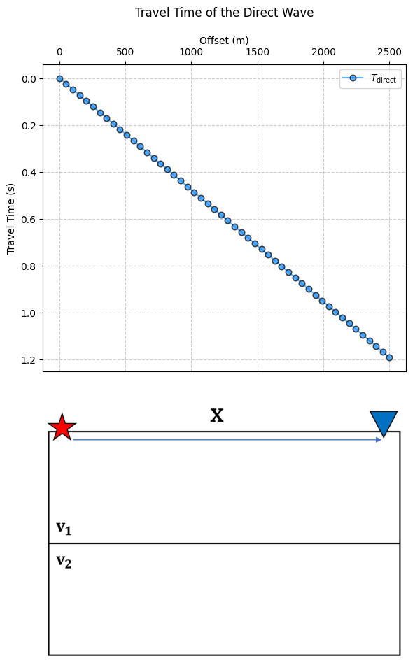
    


$$ T_{\text{reflected}} = \dfrac{\sqrt{(2z)^2+x^2}}{v_1}$$


```python
def foward_reflected_wave(x,v1,z):
    sqrt_reflection=np.sqrt((2*z)**2+x**2)
    t_reflected=sqrt_reflection/v1
    return t_reflected
```


```python
t_reflected=foward_reflected_wave(x,v1,z)
ploting_curves(x,t_reflected,'reflected',
               'the Reflected Wave','03_1')


```


    
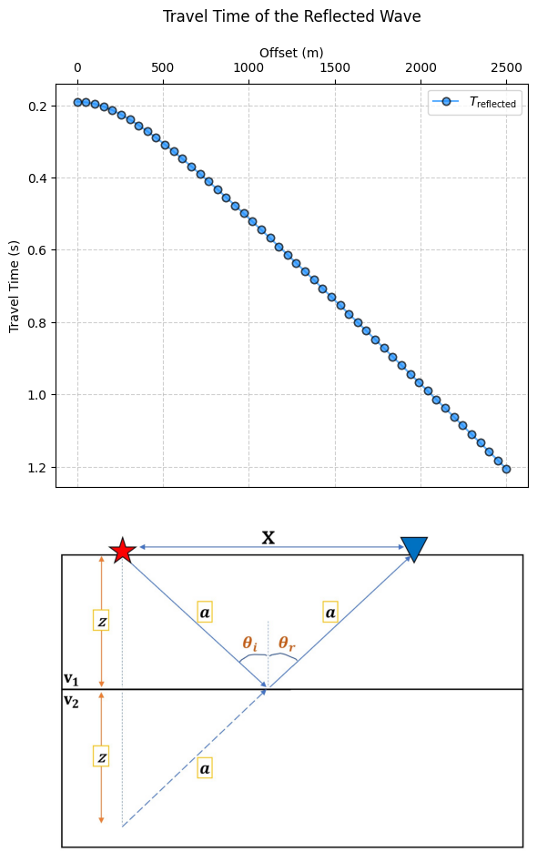
    


### 2) Traveltime of first-order multiples for a plane-parallel event

$$ T_{\text{multiple}} = \dfrac{\sqrt{(4z)^2+x^2}}{v_1}$$


```python
def foward_first_parallel_multiples(x,v1,z):
    sqrt_first=np.sqrt((4*z)**2+x**2)
    t_first=sqrt_first/v1
    return t_first
```


```python
t_first_parallel_multiples=foward_first_parallel_multiples(x,v1,z)
ploting_curves(x,t_first_parallel_multiples,'first-parallel-multiples',
               'First-order Multiples for a Parallel Planar Event',
               '04_1')

```


    
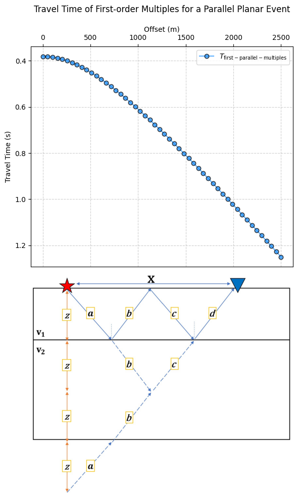
    


### 3) Travel time of the reflected wave to a reflector plane with inclination $\theta$

$$ T_{\text{reflected-theta}} = \dfrac{\sqrt{(2z)^2+x^2+4\cdot z\cdot x\cdot \sin (\theta) }}{v_1}$$


```python
def foward_reflected_plane_theta(x,v1,z,theta):
    sqrt_theta=np.sqrt((4*z)**2+x**2+4*z*x*np.sin(theta))
    t_reflected_theta=sqrt_theta/v1
    return t_reflected_theta
```


```python
t_reflected_plane_theta=foward_reflected_plane_theta(x,v1,z,theta)
ploting_curves(x,t_reflected_plane_theta,'reflected-plane-theta',
               r'the Reflected Wave to a Reflector Plane with Inclination $\theta$',
               '05_1')

```


    
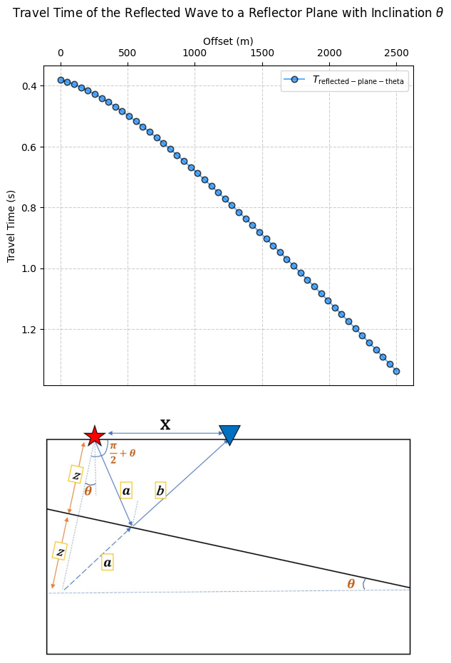
    


### 4) Travel time of the first-order multiple in plane reflectors with inclination $\theta$

$$ T_{\text{first-order-multiple-theta}} = \dfrac{\sqrt{(4z)^2+x^2+8\cdot z\cdot x\cdot \sin (\theta) }}{v_1}$$


```python
def foward_first_order_multiple_theta(x,v1,z,theta):
    sqrt_theta=np.sqrt((4*z)**2+x**2+8*z*x*np.sin(theta))
    t_first_order_multiple_theta=sqrt_theta/v1
    return t_first_order_multiple_theta
```


```python
t_first_order_multiple_theta=foward_first_order_multiple_theta(x,v1,z,theta)

ploting_curves(x,t_first_order_multiple_theta,'first-order-multiple-theta',
               rf'the Reflected Wave to a Reflector Plane with Inclination $\theta$',
               '06_1')

```


    
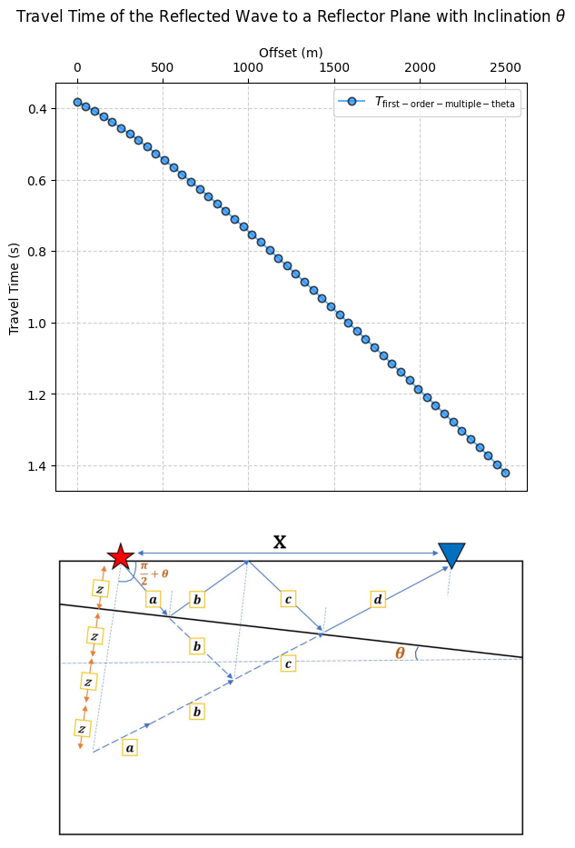
    


### 5) Travel time of converted P-SV and SV-P waves in a medium with velocities $V_{p1}/V_{s1}$ and $V_{p2}/V_{s2}$

$$ T_{\text{P-SV}} = \dfrac{z_d}{v_{p1}\cdot \cos(\theta)}+\dfrac{z_u}{v_{s1}\cdot \cos(\phi)}$$


```python
def foward_P_SV(zd,zu,vp1,vs1,theta,phi):
    t_P_SV=(zd/(vp1*np.cos(theta)))+(zu/(vs1*np.cos(phi)))
    return t_P_SV
```

$$ T_{\text{SV-P}} = \dfrac{z_d}{v_{s1}\cdot \cos(\phi)}+\dfrac{z_u}{v_{p1}\cdot \cos(\theta)}$$


```python
def foward_SV_P(zd,zu,vp1,vs1,theta,phi):
    t_P_SV=(zd/(vs1*np.cos(phi)))+(zu/(vp1*np.cos(theta)))
    return t_P_SV
```


```python
t_P_SV=foward_P_SV(zd,zu,vp1,vs1,theta,phi)
t_SV_P= foward_SV_P(zd,zu,vp1,vs1,theta,phi)

ploting_curves2(x,t_P_SV,t_SV_P,'\mathrm{P-SV}','\mathrm{SV-P}',
               r"""Converted P-SV and SV-P Waves
in a Medium with Velocities $V_{p1}/V_{s1}$ and $V_{p2}/V_{s2}$""", 
    '07_1')
```


    
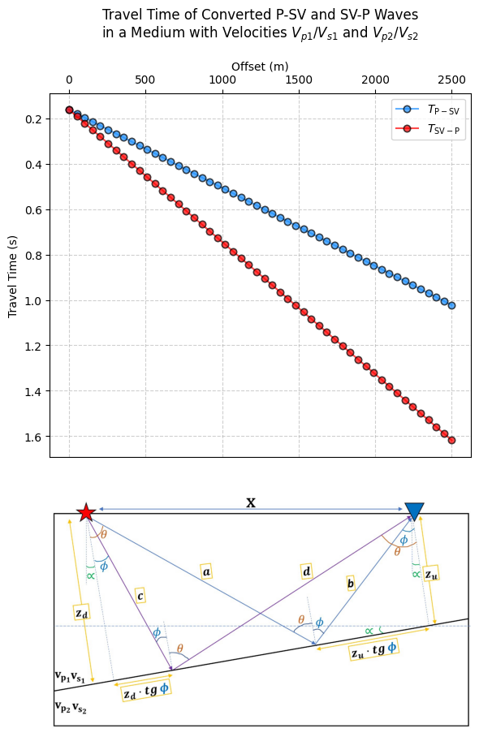
    


### 6) Travel time of the refracted wave to a parallel plane reflector

$$ T_{\text{refraction}} = \dfrac{2\cdot}{v_{1}\cdot \cos(\theta_c)}+\dfrac{x-2\cdot z\cdot \tan(\theta_c)}{v_2}$$


```python
def foward_refraction(x,v1,z,theta,v2):
    t_refraction=(2/(v1*np.cos(theta)))+((x-2*z*np.tan(theta))/v2)
    return t_refraction
```


```python
t_refraction=foward_refraction(x,v1,z,theta,v2)
ploting_curves(x,t_refraction,'refraction',
               rf'the Refracted Wave to a Parallel Plane Reflector',
               '08_1')
```


    
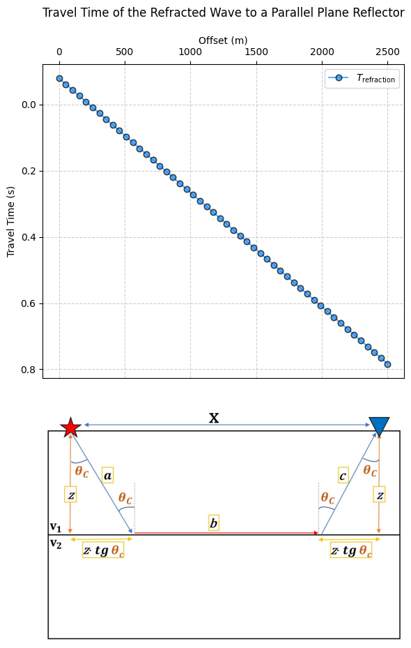
    


### 7) Travel time of the refracted wave to a plane reflector with inclination $\alpha$

$$ T_{\text{refraction}-\alpha} =\dfrac{z_d}{v_1 \cdot \cos(\theta_c)} + \dfrac{x \cdot \cos(\alpha) - z_d \cdot \tan(\theta_c) - (z_d - x \cdot \sin(\alpha)) \tan(\theta_c)}{v_2} + \dfrac{z_d - x \cdot \sin(\alpha)}{v_1 \cdot \cos(\theta_c)}$$


```python
def foward_refracted_wave_alpha(zd,zu,vp1,vs1,theta,phi):
    t_refraction_alpha=(
        zd/(v1*np.cos(theta))+ (x*np.cos(alpha)-zd*np.tan(theta)-(zd-x*np.sin(alpha)*np.tan(theta)))/v2
        + (zd-x*np.sin(alpha))/(v1*np.cos(theta))
    )
    return t_refraction_alpha

```


```python
t_refraction_alpha=foward_refracted_wave_alpha(zd,zu,vp1,vs1,theta,phi)
ploting_curves(x,t_refraction_alpha,'refraction-alpha',
               rf'the Refracted Wave to a Plane Reflector with Inclination $\alpha$',
               '09_1')
```


    
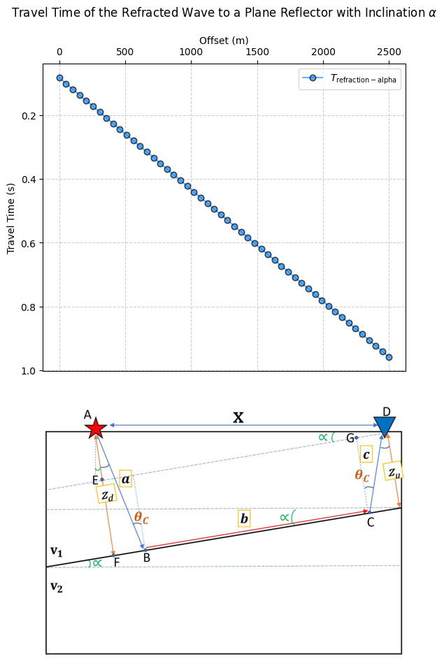
    


### 8) Travel time for a diffracting event that is not located between the source and receiver

$$ T_{\mathrm{diffraction-not-between}} = \frac{\sqrt{(x + h)^2 + z^2}}{v} + \frac{\sqrt{(x - h)^2 + z^2}}{v} $$


```python
def foward_difracted_wave_not(x,v1,z,h):
    sqrt_drifracted1=np.sqrt((x+h)**2+z**2)/v1
    sqrt_drifracted2=np.sqrt((x-h)**2+z**2)/v1
    t_difracted=sqrt_drifracted1+sqrt_drifracted2
    return t_difracted
```


```python
t_difracted_not=foward_difracted_wave_not(x,v1,z,h)
ploting_curves(x,t_difracted_not,'\mathrm{difracted-not-between-source-receiver}',
               rf'a Diffracting Event that is not'+ '\n' + 'Located Between the Source and Receiver',
               '10_1')
```


    
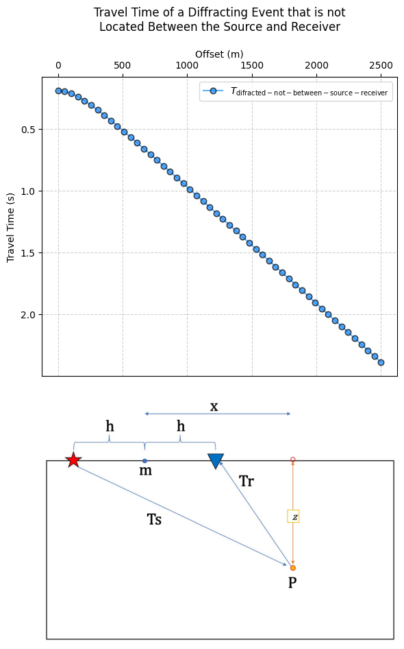
    


### 9) Travel time for a diffracting event located between source and receiver

$$T_{\mathrm{diffraction-between}} = \left( \frac{\sqrt{h_s^2 + z^2}}{v} \right) + \left( \frac{\sqrt{h_r^2 + z^2}}{v} \right)$$


```python
def foward_difracted_wave_between(v1,z,hr,hs):
    sqrt_drifracted1=np.sqrt((hs)**2+z**2)/v1
    sqrt_drifracted2=np.sqrt((hr)**2+z**2)/v1
    t_difracted=sqrt_drifracted1+sqrt_drifracted2
    return t_difracted
```


```python
t_difracted_between=foward_difracted_wave_between(v1,z,hr,hs)
ploting_curves(x,t_difracted_between,'\mathrm{difracted-between-source-receiver}',
               rf'a Diffracting Event that is '+ '\n' + 'Located Between the Source and Receiver',
               '11_1')
```


    
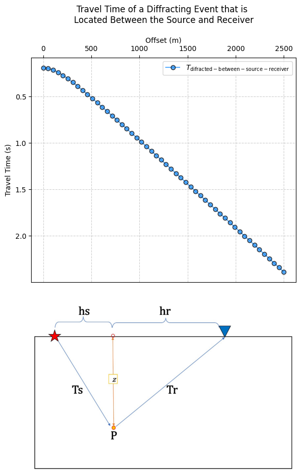
    


### 10) Travel time for a model with a linear velocity gradient given by 
###                                 $v = v0 + az$

$$ t_{\text{gradient}} = \frac{1}{a} \log \left( \frac{v(z)}{v_0} \frac{1 + \sqrt{1 - p^2 v_0^2}}{1 + \sqrt{1 - p^2 v(z)^2}} \right) $$


```python
def foward_gradient(v,p,v0):
    term_num = np.maximum(0, 1 - (p**2) * (v0**2))
    term_den = np.maximum(0, 1 - (p**2) * (v**2))

    numerator = v * (1 + np.sqrt(term_num))
    denominator = v0 * (1 + np.sqrt(term_den))
    
    t_gradient=(1/a)*np.log(numerator/denominator)
    return t_gradient
```


```python
t_gradient=foward_gradient(v,p,v0)
ploting_curves(x,t_gradient,'\mathrm{gradient}',
               rf'a model with a linear velocity gradient given by $v = v0 + az$',
               '12_1')
```


    
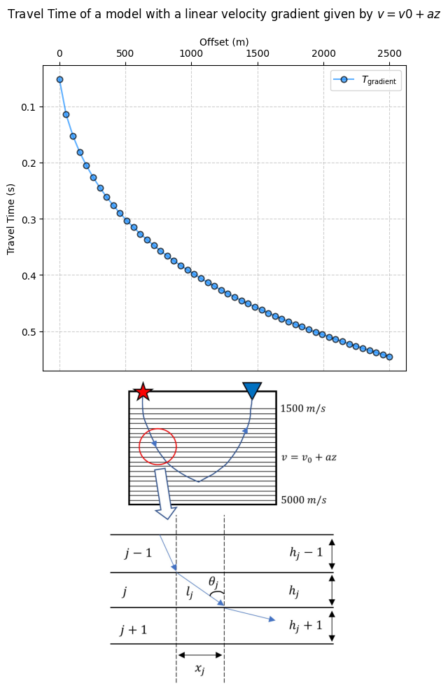
    


```python

```
